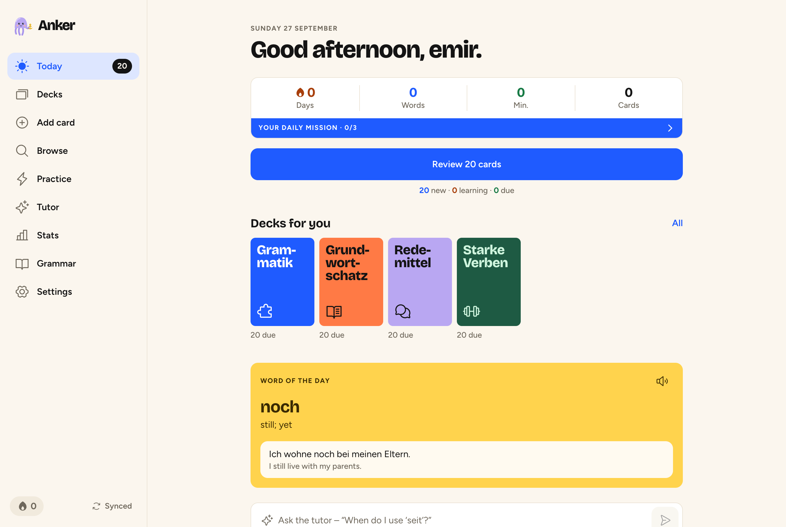
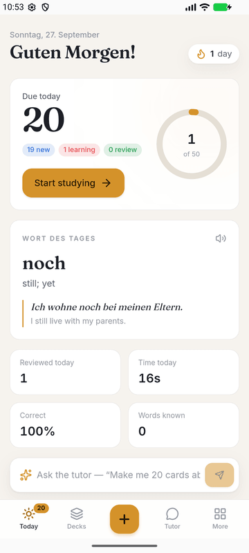
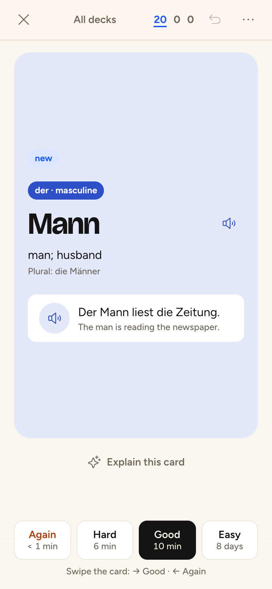
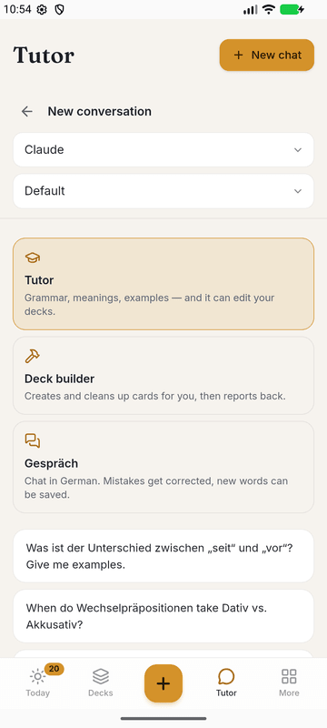
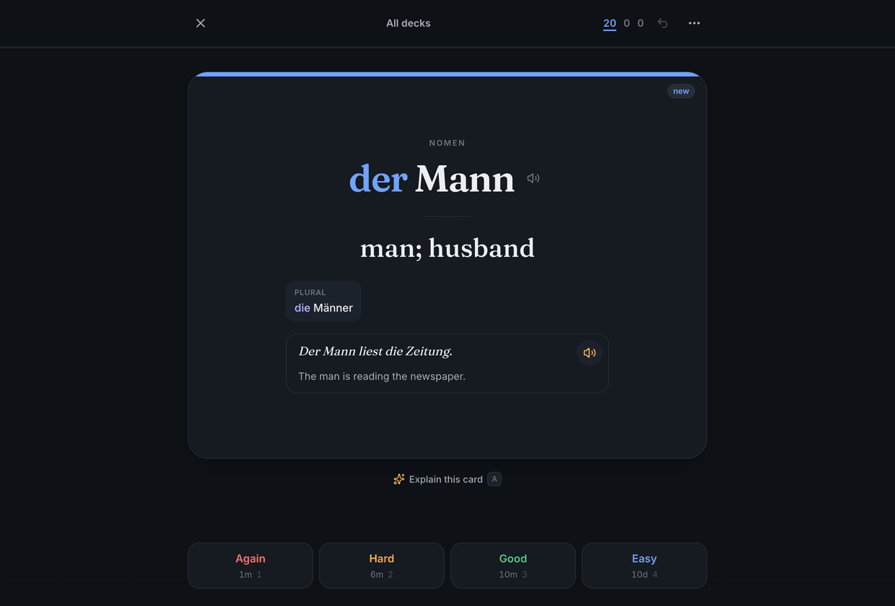
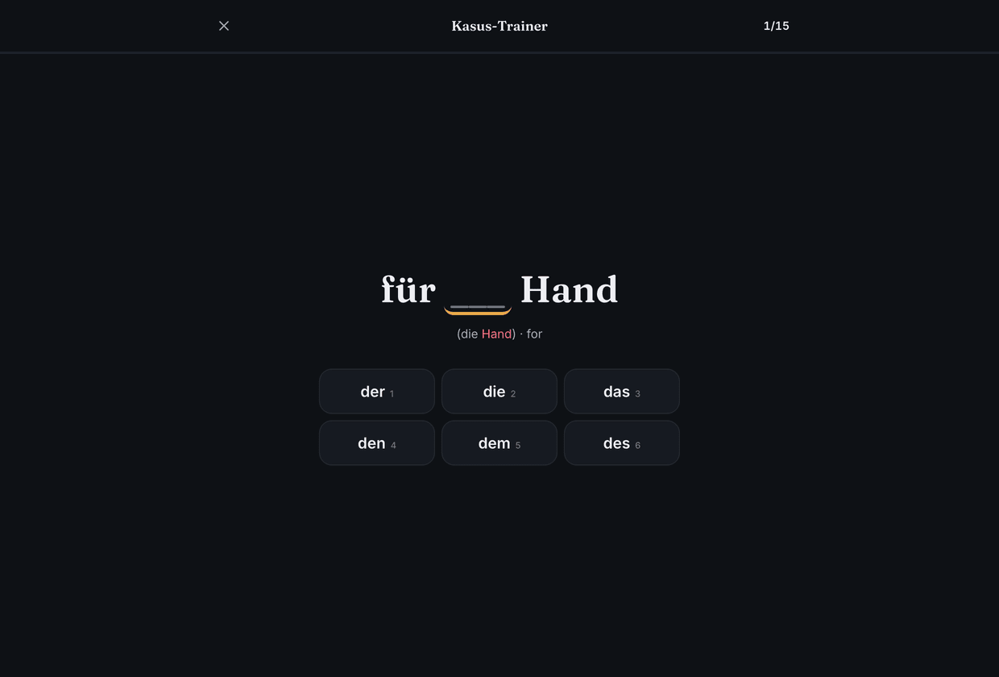
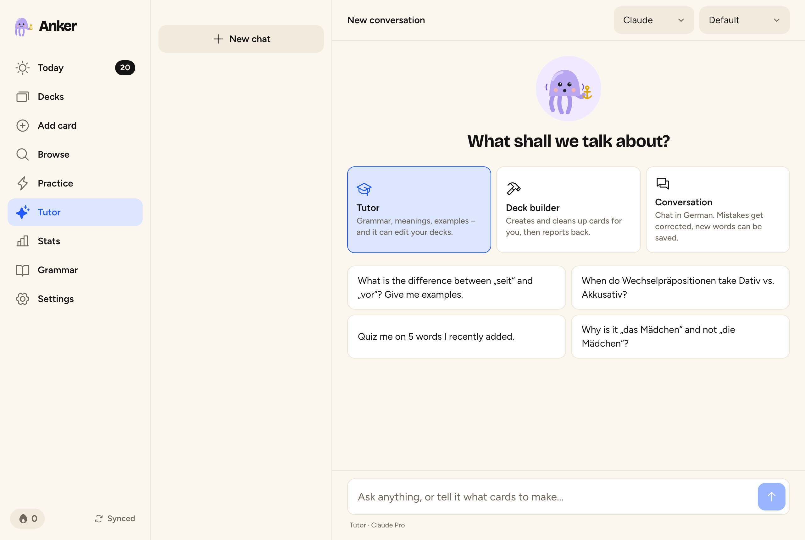

<p align="center">
  
</p>

<h1 align="center">Anker</h1>

<p align="center">
  <b>Spaced-repetition flashcards built for learning German — on your Mac and Android phone.</b><br>
  FSRS scheduling like modern Anki, a German-aware card design, practice games,<br>
  and an AI tutor that runs on <b>your own Claude and ChatGPT subscriptions</b> and edits your decks over <b>MCP</b>.
</p>

<p align="center">
  <a href="../../releases/latest">Download for Mac (Apple Silicon) · Android</a>
</p>

<p align="center">
  
</p>

<p align="center">
  
  
  
</p>

*Anker* is German for *anchor* — it anchors words in your memory. (And yes, it sounds like Anki.)

## What's inside

**A proper SRS engine**
- **FSRS** scheduling (via [`ts-fsrs`](https://github.com/open-spaced-repetition/ts-fsrs)) with learning/relearning steps, desired retention, daily new/review limits that cascade through sub-decks, sibling burying, suspend/bury/flag, undo, and leech detection.
- Note types: **Wort** (German vocabulary), Basic, Basic + reversed, **Type the answer** (letter-by-letter diff, umlaut-aware) and **Cloze** (`{{c1::…}}`).
- Search with Anki-style syntax: `deck:"Deutsch::A1" gender:die is:due -tag:done added:7 rated:1 german:haus`.
- **Anki import** (`.apkg` / `.colpkg`, old and new formats): decks, tags, images — and your **review history replayed through FSRS**, so your progress comes with you. CSV/TSV word lists and JSON backups too.

**Made for German**
- Nouns are colour-coded by gender everywhere: **der** blue, **die** red, **das** green, plural in grey — and the colour only appears after you answer on EN→DE cards, so it never gives the answer away.
- Word cards show the plural, **Stammformen** (*fährt · fuhr · ist gefahren*), comparative forms and an example sentence with translation.
- **Pronunciation**: every German word and sentence can be read aloud (macOS voices on the Mac, the Android TTS engine on the phone), automatically if you like.
- Type **"der Tisch"** in the editor and the article is split off into the gender field; get a gender guess from the ending (*-ung → die*); one-tap **AI auto-fill** of gender, plural, forms and an example.
- **394 hand-made starter notes**: *Grundwortschatz A1–A2* (236), *Starke Verben* (62), *Fälle, Präpositionen & Satzbau* cloze drills (44) and *Redemittel* incl. idioms (52).
- A **grammar reference** with declension tables, prepositions by case, gender rules (with a live "guess the gender" box), adjective endings, pronouns, numbers & time converters and word order — each with a "Practice" and "Ask the tutor" button.

**Six practice games** (they don't touch your review schedule)

| | |
|---|---|
| ⚡ **Artikel-Blitz** | der/die/das against the clock; every miss explains the matching gender rule, missed nouns can become cards |
| 🔢 **Zahlen-Diktat** | hear *vierundzwanzig*, type 24 — plus thousands, years (*neunzehnhundertvierundachtzig*) and prices |
| 🕰️ **Wie spät ist es?** | analog clock ↔ *halb acht*, *Viertel vor drei*, with the classic traps as wrong answers |
| 🎯 **Kasus-Trainer** | *mit ___ Hund* → dem; Wo?/Wohin? for Wechselpräpositionen, contractions, genitive |
| 💪 **Stammformen** | type all three forms of strong verbs, including *haben* vs *sein* |
| 🎧 **Diktat** | dictation built from the example sentences in *your* cards |

<p align="center">
  
  
</p>

## The AI tutor — Claude & Codex on your subscriptions

<p align="center"></p>

Anker doesn't use API keys. It drives the **official command-line tools** on your Mac — [Claude Code](https://docs.claude.com/en/docs/claude-code) (`claude -p`) for Claude Pro/Max and [Codex CLI](https://github.com/openai/codex) (`codex exec`) for ChatGPT Plus/Pro — so requests count against the subscriptions you already have. Sign-in happens in each CLI's own browser flow (`claude auth login`, `codex login`); **Anker never reads, stores or forwards your credentials.**

Every agent run gets Anker's MCP server attached and **nothing else**: Claude runs with built-in tools disabled (`--tools ""`), Codex with a read-only sandbox, both isolated from your personal CLI config. They can manage your decks but can't touch your files or shell.

- **Tutor** — explanations, examples, quizzes; it can create or fix cards while you chat.
- **Deck builder** — "Make me 25 A2 kitchen words", "Turn this article into cards", "Add mnemonics to my 10 hardest cards".
- **Gespräch** — conversation practice in German. Mistakes get a ✏️ *Korrektur*, and useful words can be saved to a deck.
- On any card: **Explain · More examples · Mnemonic**, streamed live.
- From the Mac's menu bar or with **⌘⌥K** anywhere: **Quick add** a word — the AI fills in the rest.

The phone uses the tutor through your Mac (see *Sync*), so your subscriptions stay on your computer.

## MCP: let Claude Code, Codex & co. manage your decks

Anker exposes 15 tools over [MCP](https://modelcontextprotocol.io): `get_overview`, `list_decks`, `create_deck`, `update_deck`, `delete_deck`, `add_words`, `add_notes`, `find_notes`, `get_notes`, `lookup_words`, `update_notes`, `move_notes`, `delete_notes`, `set_card_state`, `get_study_stats`. The server also ships instructions that teach the model Anker's conventions (article/gender split, `fährt · fuhr · ist gefahren`, duplicate checks …).

**One click:** *Settings → AI tutor → Use Anker from Claude Code & Codex → Connect.* Or by hand:

```bash
claude mcp add --scope user anker -e ELECTRON_RUN_AS_NODE=1 -- /Applications/Anker.app/Contents/MacOS/Anker /Applications/Anker.app/Contents/Resources/mcp-stdio.cjs
```

```bash
codex mcp add anker --env ELECTRON_RUN_AS_NODE=1 -- /Applications/Anker.app/Contents/MacOS/Anker /Applications/Anker.app/Contents/Resources/mcp-stdio.cjs
```

That command is a tiny stdio proxy bundled with the app: it finds the running Anker through `~/.anker/connection.json` and starts the app in the background if it isn't running. Clients that speak Streamable HTTP can use `http://127.0.0.1:4747/mcp` directly with the bearer token from that file. Then, in any Claude Code or Codex session:

> *"Add the 20 most common separable verbs to Anker under Deutsch::Verben, with examples."*
> *"Look at my Anker stats and tell me which grammar topics I keep failing."*

## Sync between Mac and phone

The Mac app is the **hub**: it keeps the master copy, runs the sync server, the MCP server and the AI bridge. Every device keeps a full local copy and works **offline**; changes sync in both directions (last writer wins per record, review logs are append-only).

1. On the Mac: *Settings → Sync & devices → Pair a phone* shows a QR code and a 6-digit code.
2. Scan it with the phone's camera and tap *Open in the Anker app* — or type the address and code under *Connect to your Mac*.
3. Same Wi-Fi at home. Away from home, install [Tailscale](https://tailscale.com) on both devices and pair using the `100.x` address — the phone tries every known address automatically.

Each paired device gets its own revocable token (only a hash is stored). The Mac keeps daily backups in `~/Library/Application Support/Anker/collection/backups`.

## Install

**Mac** (Apple Silicon): download the `.dmg` from [Releases](../../releases/latest) and drag Anker to *Applications*. The build is not notarized, so the first time right-click → *Open* (or run `xattr -cr /Applications/Anker.app`). Turn on *Settings → Mac app → Open at login* to keep sync and MCP available.

**Android**: download the `.apk` from [Releases](../../releases/latest) on your phone, allow installing from your browser, and open it. Choose starter decks or connect to your Mac.

**AI (optional)**: install [Claude Code](https://docs.claude.com/en/docs/claude-code) and/or [Codex CLI](https://github.com/openai/codex) on the Mac, then sign in from *Settings → AI tutor*.

**Always-on hub (optional)**: the hub also runs without the Mac app — e.g. on a Mac mini or a server with the CLIs installed: `npm run hub` (serves the web app too; open the printed link to connect a browser).

## Development

```bash
npm install
npm run dev          # hub on :4848 (separate data dir) + Vite on :5173
npm test             # FSRS/queue/German helpers/content tests
npm run typecheck
npm run build:mac    # → packages/desktop/release/Anker-<version>-arm64.dmg
npm run build:android  # needs JDK 21 + Android SDK → packages/app/android/app/build/outputs/apk/release/
```

```
packages/
  core/     FSRS scheduler, study queue, note types, search, stats, sync protocol,
            German helpers (gender rules, numbers, clock, declension) and starter content
  hub/      Node server: append-only record store, sync API, MCP server (stdio + HTTP),
            Claude/Codex bridge, device pairing — runs inside the Mac app or standalone
  app/      React 19 + Tailwind 4 UI (IndexedDB via Dexie, offline-first sync engine);
            also the Capacitor 8 Android app (packages/app/android)
  desktop/  Electron shell: embedded hub, menu-bar item, dock badge, quick-add window,
            reminders, packaging
```

Release builds for macOS and Android run in GitHub Actions for every `v*` tag. Android release signing uses the `ANDROID_KEYSTORE_BASE64`, `ANDROID_KEYSTORE_PASSWORD`, `ANDROID_KEY_ALIAS` and `ANDROID_KEY_PASSWORD` repository secrets; without them CI signs with a debug key.

## License

MIT
